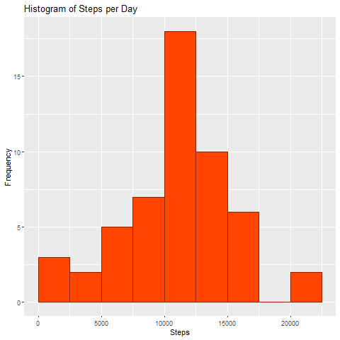
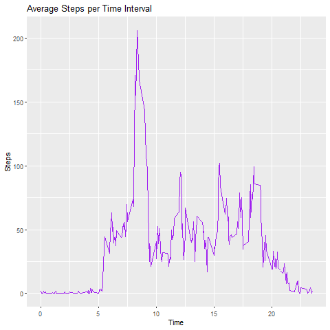
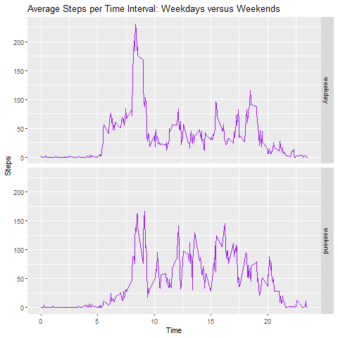

The following document specifies the submission for the first peer-review assignment for the course *Reproducible Research*. Several steps are defined below. 


## Loading the Data and Preprocessing the Data
The first part of the analysis consists out of *loading the data*. This is done by applying the chunck of code specified below.  

```{r, echo = TRUE}
unzip("activity.zip")
data_activity <- read.csv("activity.csv")
```

Three libaries (*ggplot2*, *knitr* and *dplyr*) are loaded through the chunck of code below. 

```{r, eval = FALSE}
library(dplyr)
library(ggplot2)
library(knitr)
```

The data consists out of three variables. These being the following: 

* **Steps**: The number of steps taken in a 5 - minute interval. (NA = A missing value) 
* **Date**: The date on which the measurements were taken. (YYYY - MM - DD)
* **Interval**: Identifiers for the interval in which a measurement was taken.

The code below specifies how this information was retrieved.

``` {r, echo = TRUE}
str(data_activity)
````


## The Mean of the Total Number of Steps taken per Day
Displaying the mean total number of steps taken per day is done by subsequently covering three distinct steps. These being: 

* **(1)** Calculating the total numbers of steps taken per day. 
* **(2)** Making a histogram of the steps taken per day.
* **(3)** Reporting the mean and median total number of steps taken per day.


#### 1. The Number of Steps per Day.
The number of steps taken per day is calculated through the folllowing code (Note that we are allowed to ignore the NA values): 
```{r, echo = TRUE}
StepsDay <- aggregate(data_activity$steps, list(data_activity$date), FUN = sum)
colnames(StepsDay) <- c("Date", "Steps")
StepsDay
```


#### 2. Histogram of the Steps per Day 
Drawing the histogram is done by using *ggplot2* The following chunck of code specifies this. 
```{r, echo = TRUE}
library(ggplot2)

histogramplot <- ggplot(StepsDay, aes(Steps))
final_histogram <- histogramplot + geom_histogram(boundary = 0, binwidth = 2500, col = "orangered4", fill = "orangered1") + ggtitle("Histogram of Steps per Day") + xlab("Steps") + ylab("Frequency")
final_histogram
```

In order to make the histogram downloadable, the following code can be executed:

```{r, eval = FALSE}
png("./figures/Histogram of Steps.png")
final_histogram
dev.off()
````

```{r, echo = TRUE}
library(knitr)

```


#### 3. Reporting the Mean and Median of the Total Number of Steps taken per Day
Calculating the mean and median of the total number of steps taken per day is done by applying the following chuck of code: 

```{r, echo = TRUE}
mean(StepsDay$Steps, na.rm = TRUE)
median(StepsDay$Steps, na.rm = TRUE)
```

It can be concluded that the Mean and Median are respectively *10766.19* and *10765*.


## Daily Activity Pattern
Assessing the Daily Activity Pattern is done by means of two steps. Them being the following: 

* **(1)** Creating a time series plot of the 5-minute interval and the average number of steps taken, averaged across all days.
* **(2)** Looking at the 5-minute interval which contains the maximum number of steps. 


#### 1. Creating a Time Series Plot
The following chunk of code is applied in order to create a Time Series Plot. First of all, the steps per interval are selected before using *ggplot2* to create the Time Series Plot. 

```{r, echo = TRUE}
library(ggplot2)

StepsInterval <- aggregate(steps ~ interval, data = data_activity, FUN = mean, na.action = na.omit)
StepsInterval$time <- StepsInterval$interval/100

time_series <- ggplot(StepsInterval, aes(time, steps))
final_time_series <- time_series + geom_line(col = "purple") + ggtitle("Average Steps per Time Interval") + xlab("Time") + ylab("Steps")
final_time_series
```

In order to make the time series downloadable, the following code can be executed:

```{r, eval = FALSE}
png("./figures/Time Series of Steps.png")
final_time_series
dev.off()
```

```{r, echo = TRUE}

```


#### 2. 5-Minute Interval with Maximum Number of Steps
Assessing the 5-minute interval with the maximum number of steps is done by using *dpylr*. The following chunck of code is used. 

```{r, echo = TRUE}
library(dplyr)
MAX <- tibble :: as_tibble(StepsInterval)
MAX %>% select(time, steps) %>% filter(steps == max(MAX$steps))
```


## Imputting Missing Values
The following chuncks of code are concerned with analysing the number of NAs in the dataset. The following steps will be taken: 

* **(1)** Calculate and Report the total number of missing values.
* **(2)** Devise a strategy for filling in all the missing values in the dataset.
* **(3)** Create a new dataset which includes the filled in NAs.
* **(4)** Make a histogram, reporting both the mean and median. 


#### 1. Calculate and Report the Missing Values
The number of NAs will, once again, be calculated by using *dyplr*

```{r, echo = TRUE}
library(dplyr)
NUMBER <- tibble :: as_tibble(data_activity)
NUMBER %>% filter(is.na(steps)) %>% summarize(missing_values = n())
```
The table shows that there is a total of 2304 Missing Values. 


#### 2. Replacing the Missing Values
The mean of the average steps per 5-minute interval is used in order to replace the NA values.

```{r, echo = TRUE}
data_activity$CompleteData <- ifelse(is.na(data_activity$steps), round(StepsInterval$steps[match(data_activity$interval, StepsInterval$interval)], 0), data_activity$steps)
```


#### 3. Create a New Dataset 
The new dataset is created y using the impot from the previous step. The function head() is used to display the first few lines of the new dataset. 

```{r, echo = TRUE}
data_activity_full <- data.frame(steps = data_activity$CompleteData, interval = data_activity$interval, date = data_activity$date)

head(data_activity_full, n = 20)
```


#### 4. Create a Histogram
A histogram is created, which marks the mean and median. These descriptive measures will be compared with earlier calculations. The histogram is plotted using *ggplot2* 

```{r, echo = TRUE}

StepsDayFull <- aggregate(data_activity_full$steps, list(data_activity_full$date), FUN = sum)
colnames(StepsDayFull) <- c("Date", "Steps")

histogram_full <- ggplot(StepsDayFull, aes(Steps))
histogram_full_final <- histogram_full + geom_histogram(col = "slateblue4", fill = "slateblue") + ggtitle("Histogram of Steps per Day") + xlab("Steps") + ylab("Frequency")
histogram_full_final
```

In order to make the histogram downloadable, the following code can be executed:

```{r, eval = FALSE}
png("./figures/Histogram of Steps (FULL DATA).png")
histogram_full_final
dev.off()
```

```{r, echo = TRUE}
include_graphics("./figures/Histogram of Steps (FULL DATA).png")
```

The mean and median are calculated through the folowwing chunck of code: 

```{r, echo = TRUE}
mean(StepsDayFull$Steps)
median(StepsDayFull$Steps)
```

It can be concluded that the input of values instead of NAs has little to no impact on the mean and median. 


## Differences in Activity Patterns between Weekdays and Weekends
The last part of this assignment consists out of two distinct steps.

* **(1)** Creating a new factor variable in the dataset with two levels: "weekday" and "weekend"
* **(2)** Creating a panel plot, containing a time series plot and the average number of steps taken.


#### 1. Creating a New Factor Variable
The following function creates a new variable which evaluates whether a day is a "weekday" or a "weekend"

```{r, echo = TRUE}
data_activity_full$RealDate <- as.Date(data_activity_full$date, format = "%Y-%m-%d")
data_activity_full$Weekday <- weekdays(data_activity_full$RealDate)
data_activity_full$Type <- ifelse(data_activity_full$Weekday == 'zaterdag' | data_activity_full$Weekday == 'zondag', 'weekend', 'weekday')
head(data_activity_full, n = 20)
```

Excuse the Dutch :) Maandag means Monday, Dinsdag is Tuesday, Woensdag is Wednesday, Donderdag is Thursday, Vrijdag is Friday, Zaterdag is Saturday and Zondag is Sunday. 


#### 2. Creating a Panel Plot
First of all, a table will be created with the steps per interval across weekdays or weekend days. 

```{r, echo = TRUE}
StepsIntervalType <- aggregate(steps ~ interval + Type, data = data_activity_full, FUN = mean, na.action = na.omit)
```

The variable *Time* is added.

```{r, echo = TRUE}
StepsIntervalType$time <- StepsIntervalType$interval/100
```

The plot is drawn using *ggplot2*

```{r, echo = TRUE}
library(ggplot2)
panel_plot <- ggplot(StepsIntervalType, aes(time, steps))
panel_plot_final <- panel_plot + geom_line(col = "purple") + ggtitle("Average Steps per Time Interval: Weekdays versus Weekends") + ylab("Steps") + xlab("Time") + facet_grid(Type ~ .)
panel_plot_final
```

In order to make the panel plot downloadable, the following code can be executed:

```{r, eval = FALSE}
png("./figures/Panel Plot of Weekdays vs Weekends.png")
panel_plot_final
dev.off()
```

```{r, echo = TRUE}

```


